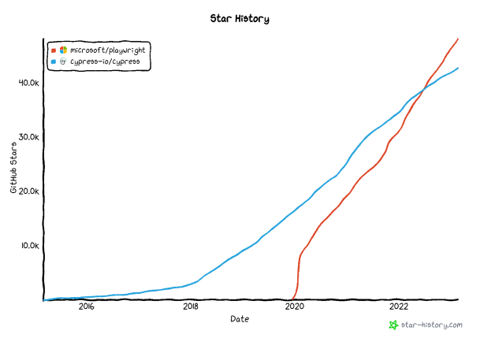

# Playwright vs Cypress

Back around 2020, I chose to use Cypress for E2E tests and had a relatively good experience.  
With Playwright rising in popularity, how does it compare to Cypress which had a head start?

## General differences



- **Popularity**
  - Playwright caught up to Cypress in 2022 and has been climbing faster than Cypress
- **Browsers**
  - Cypress uses an app to run tests, and you can easily switch browsers in the app while running tests
  - Playwright directly interfaces with browser binaries, which contributes to its strength in performance
  - Cypress's Webkit browser is still experimental
- **Writing tests**
  - Playwright has a VSCode extension to facilitate development. You can easily run/debug tests within VSCode or use the Codegen tool to record tests
  - The Cypress app can do the same, but also offer the ability to "time travel" back to specific test steps for debugging
    - In my experience however, the time travel ability is rarely useful
- **Open source**
  - While both tools have an entity behind them, Cypress currently has vested interest in their SaaS Cypress Cloud
  - This slowed QoL features that could've existed in the base library
  - It has also in my opinion, stunted the development in the performance angle (running tests in parallel, sharding tests.. etc)
  - A popular alternative is to use [Sorry Cypress](https://github.com/sorry-cypress/sorry-cypress), which can be self-hosted
- Component tests
  - Both tools have ways to write component tests, but this is out of scope for this comparison (I have no intention to deviate from Vitest+RTL)

 **In my opinion, Playwright is the safer pick moving forward.** It has more eyes watching it and has a respectable cadence. 
The Cypress app had more time in the oven, but Playwright's VSCode extension is not far behind.

## Foreword: Comparison setup

In this repository, some of Cypress's [kitchen sink test suites](https://github.com/cypress-io/cypress-example-kitchensink/tree/master/cypress/e2e) were migrated to Playwright. Even though they were written for Playwright, the titles were kept in sync for easy comparison. 

I'll use these selected test suites for discussion points:

| Cypress                                                                    | Playwright                                                             |
| -------------------------------------------------------------------------- | ---------------------------------------------------------------------- |
| [todo](cypress/e2e/1-getting-started/todo.cy.js)                           | [todo](tests/1-getting-started/todo.spec.ts)                           |
| [actions](cypress/e2e/2-advanced-examples/actions.cy.js)                   | [actions](tests/2-advanced-examples/actions.spec.ts)                   |
| [aliasing](cypress/e2e/2-advanced-examples/aliasing.cy.js)                 | [aliasing](tests/2-advanced-examples/aliasing.spec.ts)                 |
| [cookies](cypress/e2e/2-advanced-examples/cookies.cy.js)                   | [cookies](tests/2-advanced-examples/cookies.spec.ts)                   |
| [network_requests](cypress/e2e/2-advanced-examples/network_requests.cy.js) | [network_requests](tests/2-advanced-examples/network_requests.spec.ts) |

Note that it is definitely **not** an apples-to-apples comparison, there are some minor differences that might give an edge to 1 tool over the other. 
I've tried to tweak it as much as possible to not affect the overall outcome of the test suites.

## Performance

### Local runs

- All tests are recorded headlessly on my PC, with no video recording
- Recorded times are average over 5 runs, excluding the cold start
- "w/ startup" means total run time after the test command is executed
- "w/o startup" means the total test time reported by Cypress/Playwright

| Runs                                    | All 35 tests |
| --------------------------------------- | ------------ |
| Cypress run (w/ startup)                | 43.5s        |
| Cypress run (w/o startup)               | 35.0s        |
| Playwright (single worker, w/ startup)  | 25.8s        |
| Playwright (single worker, w/o startup) | 25.1s        |
| Playwright (6 workers, w/ startup)      | 6.9s         |
| Playwright (6 workers, w/o startup)     | 6.3s         |

 **Playwright is the better option when writing tests locally**

### CI Runs

- Playwright offers the ability to shard tests out of the box
- Cypress Cloud orchestrates CI tests and can take a step further by optimizing sharded tests
  - e.g. test-runner-1 takes 2 long tests, test-runner-2 takes 4 shorter tests
  - With the more naive approach in Playwright, it'll be cleanly divided where each runner take 3 tests

**All 35 tests**  
  
  


 **Unless you're a paying customer of Cypress Cloud, Playwright is the better option here (purely on the performance angle)**

## API differences

Beyond performance, there's also Developer Experience (DX). I'll compare these tools on a few select topics that I find important.

### Async/await vs promise chaining

Most of my JS/TS code are written with async/await but because of Cypress, I was somewhat used to promise chaining. 
When I first tried Playwright, having to write `await` for almost every single command immediately felt like needless boilerplate code.

After spending just a bit of time with Playwright however, it clicked for me and now I'm not sure if I can agree with the choice made by Cypress [(reference)](https://docs.cypress.io/faq/questions/using-cypress-faq#Can-I-use-the-new-ES7-async--await-syntax) 

Consider the following example, a snippet from `network_requests`. We want to:
1. Call an API
2. Use the response to call another API
3. Run an assertion on the response of the 2nd API 

```js
// Cypress
cy.request("https://jsonplaceholder.cypress.io/users?_limit=1")
  .its("body")
  .its("0")
  .then((user) => {
    cy.request("POST", "https://jsonplaceholder.cypress.io/posts", {
      userId: user.id,
      // ...redacted
    });
  })
  .then((response) => {
    expect(response).property('status').to.equal(201)
    // ...redacted
  });
```

```js
// Playwright
const response = await request.get("https://jsonplaceholder.cypress.io/users?_limit=1");
const body = await response.json();
const user = body[0];

const response2 = await request.post("https://jsonplaceholder.cypress.io/posts", {
  data: {
    userId: user.id,
    // ...redacted
  },
});
const body2 = await response2.json();
expect(response2.status()).toBe(201);
// ...redacted
```

Promise chaining can get difficult to read quickly, even though you might not need to do this often in Cypress.  
You also have to learn Cypress's APIs such as `its` & `wrap`, instead of what you're used to in native Javascript.

 **If you are someone who typically writes async/await for your application code, then Playwright should appeal to you more.**

### Query mechanism

In my experience, both tools have the means to locate/query anything you need.  
The point of contention is how intuitive or how difficult is it to use.

Consider the following, a snippet from `aliasing`. We want to:
1. Get the table by class name
2. Find the first row
3. Find the first cell of the first row
4. Find the button in the first cell

<!-- prettier-ignore -->
```js
// Cypress
cy.get('.as-table')
  .find('tbody>tr')
  .first()
  .find('td')
  .first()
  .find('button').as('firstBtn')
```

We can easily convert this to follow the same flow of logic using Playwright:

<!-- prettier-ignore -->
```js
// Playwright
const firstBtn = page
  .locator(".as-table")
  .locator("tbody>tr")
  .first()
  .locator("td")
  .first()
  .locator("button");
```

Of course, this example is contrived because it is used to demonstrate their API. 
The better way to achieve the same outcome is not to iterate through the table, but to find the content. This is a more resilient approach because the content is less likely to change, when you compare to using the order of the table content (what if it's sorted or filtered?). 

```js
// Cypress
cy.get("td").contains("Row 1: Cell 1").find("button").as("firstBtn");

// Playwright
const firstButton = page.getByRole("cell", { name: "Row 1: Cell 1" }).getByRole("button");
```

It might be subjective at this point, but using Playwright's APIs (`getByRole`, `getByLabel`) felt intuitive to me. 
It didn't quite feel like I had to learn a new tool, as long as I understood the markup of my application. 
In a way, this is also true for reading tests. Comparing the two 1-liners, I am able to understand the intent of the line from Playwright slightly easier.

This is not to say Cypress is worse on all fronts, I do appreciate small quality of life functions such as:

- Traversing the DOM - `.siblings()`, `.prev()`, `.next()`, `.parent()`
- Checking dropdown by value - `.check("value")`

My bigger issue with Cypress is the amount of APIs you have to learn:

- Having to use [aliases](https://docs.cypress.io/guides/core-concepts/variables-and-aliases) to workaround network requests and other problems
- Cypress also comes with `jQuery`, and their examples for [`invoke`](https://docs.cypress.io/api/commands/invoke#jQuery-method) function is littered with jQuery usage. As a dev who has no `jQuery` experience, this is just another API I'll have to learn

**Right now, I cannot objectively say Playwright is better, but I do enjoy writing tests in Playwright more.**

### Assertions

They both have their own quirks to learn and are fairly sound in my experience.

- Example where there's little difference
  ```js
  // Cypress
  expect(response).property('body').to.contain({ title: 'Cypress Test Runner' })

  // Playwright
  expect(body).toHaveProperty("title", "Cypress Test Runner");
  ```
- Playwright has lesser "helpers" example 1
  ```js
  // Cypress
  expect(user).property('id').to.be.a('number')
  
  // Playwright
  expect(typeof user.id).toBe("number")
  ```
- Playwright has lesser "helpers" example 2
  ```js
  // Cypress
  cy.get('.action-select-multiple')
    .select(['fr-apples', 'fr-oranges', 'fr-bananas'])
    .invoke('val')
    .should('deep.equal', ['fr-apples', 'fr-oranges', 'fr-bananas'])

  // Playwright
  await expect(page.locator(".action-select-multiple")).toHaveValues(["fr-apples", "fr-oranges", "fr-bananas"]);
  ```

**In my experience, I don't find one to be better than the other. Playwright might have lesser assertions but I've yet to find myself missing Cypress's assertion library; I've not once used `deep.equal` for example.**

### Combating flake

A flaky test means it passes/fails inconsistently, often not because of the application you're testing.  
The nature of end-to-end tests simply means there are more points of failure; e.g. network intermittence, conflicts in databases

In my experience with Cypress, I almost always used `cy.wait()` to wait for network requests to complete.
While this alone isn't enough to remove flake entirely, it helps decrease the likeliness of flake.

Out of the box, [Playwright has the same API](https://playwright.dev/docs/api/class-page#page-wait-for-response) and a couple more features that I think helps a lot:

- You can manually encompass blocks of logic to retry, even with exponential backoff [(reference)](https://playwright.dev/docs/test-assertions#retrying)
  - This is helpul when you're aware of flaky portions of your test but you're unable to directly fix that behavior
    - For example, an update to a resource separately causes it to be indexed into my search service. Since this service runs asynchronously to the update API, I cannot wait for the API response to assume it has been indexed. I used to set an arbitrary wait time with Cypress before running a search query, but manually retrying would be a much more resilient approach
  - ~~You _cannot_ do this in Cypress, you'd have to rely on the entire test case retrying.~~ It seems this [new API](https://docs.cypress.io/api/cypress-api/custom-queries) in Cypress can retry to a certain degree, but it requires you to write a custom query
- You can wait for the page to emit the `networkidle` event [(reference)](https://playwright.dev/docs/test-assertions#retrying)
  - This is helpful especially coming from Cypress; I don't want to have to write `cy.wait` for every API call in the page

 **It is simply easier with Playwright**

### Quick, miscellaneous comparisons

- Launching a server to test against
  - Playwright has the ability to start dev server without 3rd party support [(reference)](https://playwright.dev/docs/test-advanced#launching-a-development-web-server-during-the-tests)
  - Cypress requires modules such as `wait-on` or `start-server-and-test` [(reference)](https://docs.cypress.io/faq/questions/using-cypress-faq#How-do-I-wait-for-my-application-to-load)
- Testing multiple tabs
  - Playwright has first class support [(reference)](https://playwright.dev/docs/pages#multiple-pages)
  - Cypress claims it will never have multi-tab support [(reference)](https://docs.cypress.io/guides/references/trade-offs#Multiple-tabs)
- Plugins
  - One of the things I dislike in Cypress is how some basic functionality is kept separately in plugins: [`networkIdle`](https://github.com/bahmutov/cypress-network-idle), [`wait-until`](https://github.com/NoriSte/cypress-wait-until), [`drag-and-drop`](https://github.com/4teamwork/cypress-drag-drop) (all of these are built into Playwright)
  - Up until Cypress v9.3, you even had to use a plugin for uploading files: [cypress-file-upload](https://github.com/abramenal/cypress-file-upload)
  - Is it better than Playwright, which has no plugin support? I'd say I have only used plugins that should have been built-in anyway
- Custom commands
  - A redeeming feature I found easier to use in Cypress are custom commands
  - You can of course write reusable code as just functions, [Page Object Models](https://playwright.dev/docs/pom), etc. But Cypress's approach felt more intuitive so far
